# NPCI Hackathon
### Team Name - *Hucker*
> ###### Team Members
> - Rayan Halder ( Leader )
> - Saransh Yadav
> - Suraj Khot
> - Krish Agarwal

## Problem Statement

> ### Unified Reward Systems
>
> Many apps and shops offer reward points to loyal customers. These points can only be used at those respective shops / apps. From the customer point of view, it would be beneficial to merge reward points or use them across sellers.

## Brief Summary of our Solution

Our solution to the unifying reward points across many businesses involves selling reward points to businesses, which lets them set up their own methods of distributing these points to consumers. The manner in which they distribute these points can boost their customer base and loyalty as these customers will be inclined to shop at businesses that provide better rewards. Together with a robust UPI integration, that guarantees a seamless experience and addresses safety concerns, our app provides a modern paradigm of online shopping. 

> Link to our [Presentation](https://docs.google.com/presentation/d/e/2PACX-1vREr8j74FDXvrvTm-7d6b8uVqr7pwL-kQQ78UtvZLIQA-B5s5g1sftr8iy6GznI5GnVFWvYZbaVTXY1/pub?start=false&loop=false&delayms=3000)

> A downloaded version of the presentation is available in `presentation/` in a [PDF](presentation/NPCI-Hackathon.pdf) and in a [PPTX](presentation/NPCI-Hackathon.pptx) version.

## Our Mobile App - UPerks

The App is made using ***Dart*** and ***Flutter*** with ***Firebase*** acting as the backend for it for authentication and database needs.

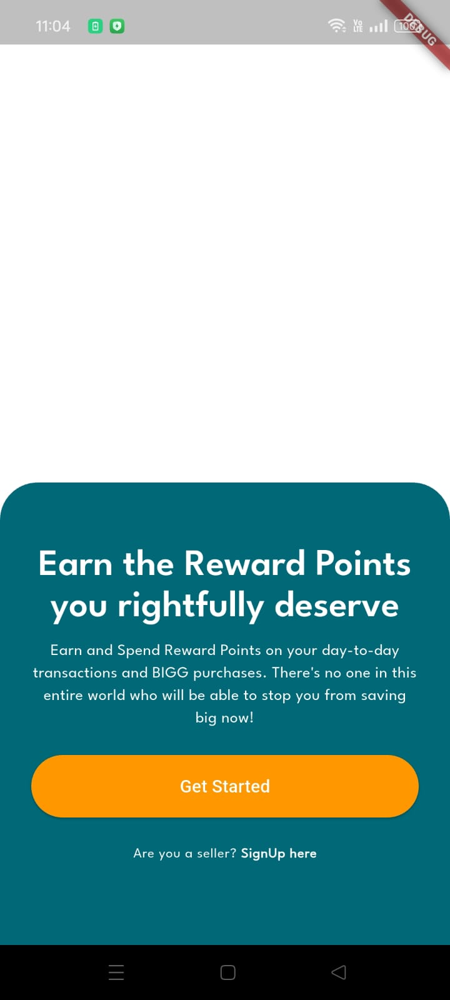

The app opens to a screen with a "Get Started" button for consumers to begin using the app, or for sellers to register their shop / business into the system. 


Consumer Interface:

The consumer clicks 'Get Started' and uses their Google Account to sign into the app. Without any additional sign up requirements, the user gains direct access to their UPerks account. 

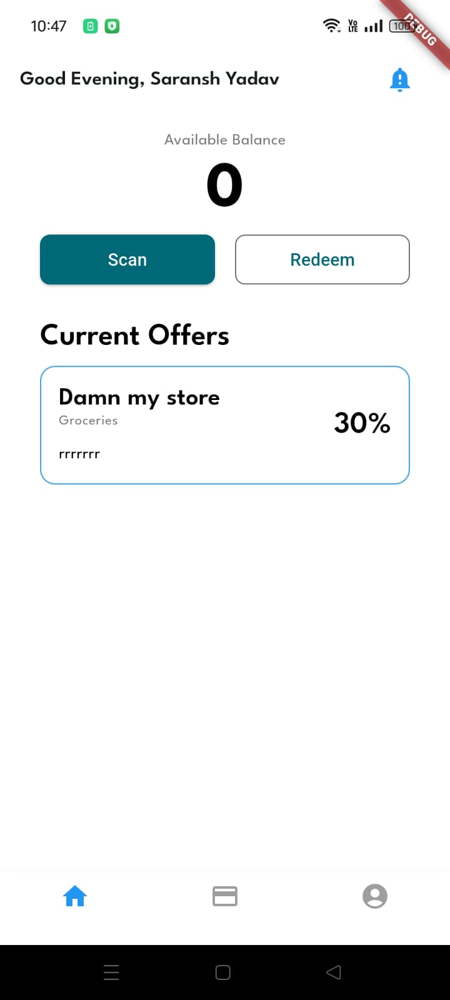

The home screen has a banner which shows the customer how many reward points they have amassed. The Scan button allows them to scan a unique QR code at the business they are shopping at. After scanning this QR, the customer enters the amount that they have paid and sends a request to the business. The business approves this (as explained later) request to accredit the customer with the appropriate amount of rewards points (which is calculated automatically). This addition is updated on reloading the reward point counter. The redeem button works in the opposite way. It allows the customer to scan a QR code at any participating business to send a request to the seller by first entering the bill amount. Then, they can choose how many reward points to allocate ('Reward Points Using') to the purchase, which shows the exact discount received under the 'Redeem Amount.' After clicking 'Complete Transaction,' we plan on implementing integration with real money by linking the UPI accounts of buyers and sellers with the app.  

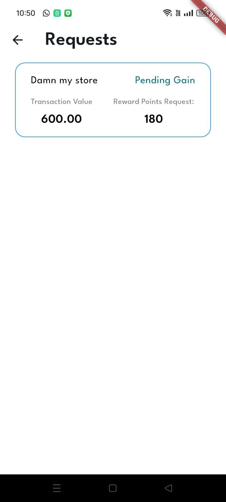
On clicking the notifications icon, you can see all pending transactions that you have requested. Underneath your reward point balance, the 'Current Offers' section shows stores with their categories, address (in the app, we have used rrrrrrr as a placeholder) and the offer percent on each qualifying transactions. 

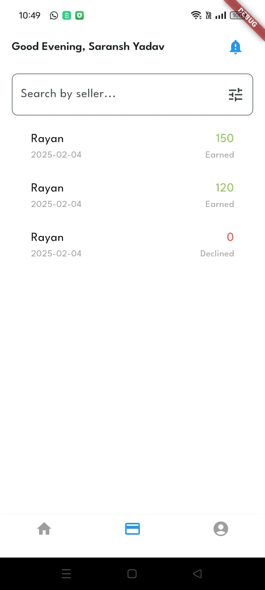
The transactions page, accessible through the middle button on the navigation bar on the bottom of the screen shows a detailed history of the transactions made and reward points used by the customer. There is a search bar with filters at the top to look for transactions by the name of the store, or the category of the transaction (namely, redeemed, earned, and shared). 

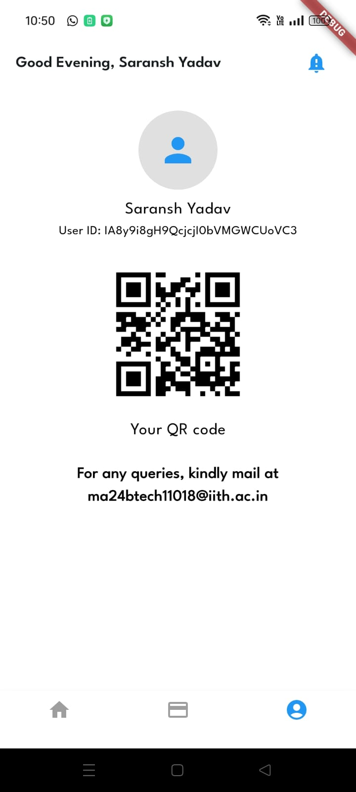
The profile page, accessible through the rightmost button on the navigation bar on the bottom of the screen shows the user's profile with their name and User Id. A QR code is placed in the center of the screen, for future plans of implementing a way for users to share reward points with each other. 


Seller Interface:
A seller will click the 'SignUp Here' on the opening screen of the app, which redirects them to a screen that lets them sign in with their Google Account. After signing in, they fill out a form with all the specifications of their business to register it under our app. The offer percent is the amount of reward points that the store offers over the offers threshold they specify.

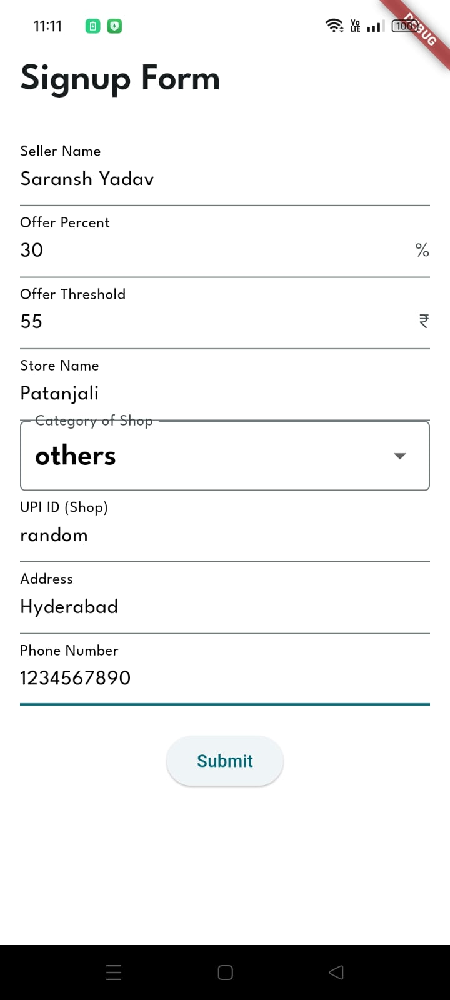
After clicking submit, the seller is directed to the My Store Page. Here, they can view their available balance (that they can distribute to their customers). They may increase their balance by using the 'Buy Points' button. The 'Change Offer' button will be implemented soon, allowing the seller to change their offer percent as need be.

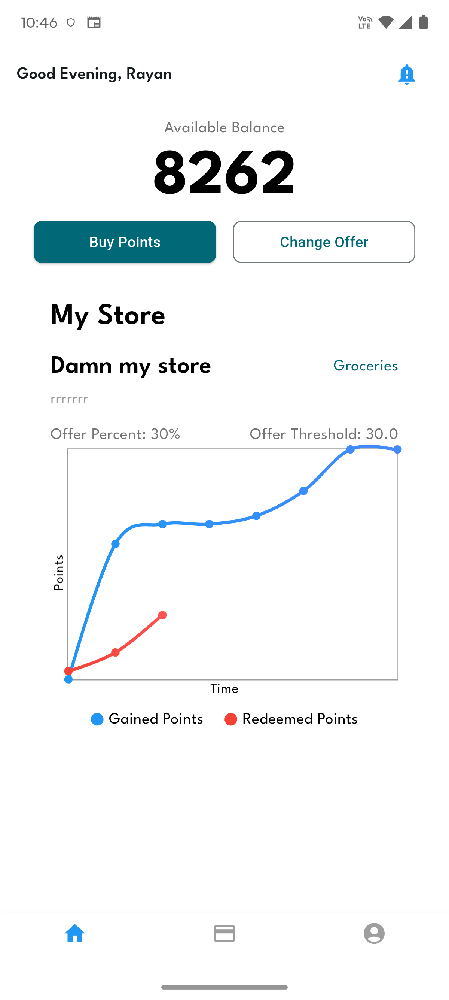

A graph in the My Store Page will show the variation of cumulative reward points (in blue) and redeemed points (in red) at their business. 

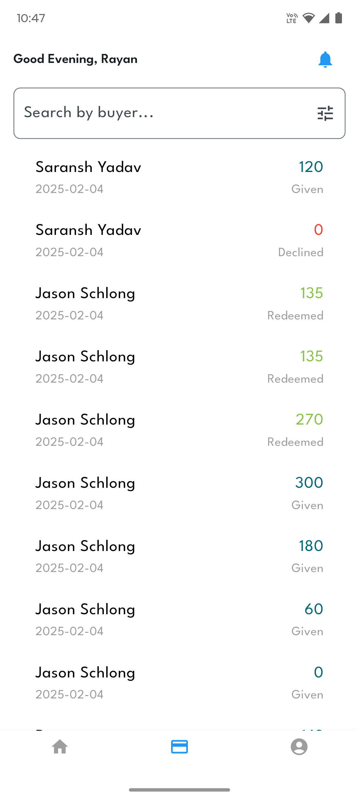

The transactions page shows a detailed history of the transactions made at or by the store. In the app we made, you will see a transaction with 'Admin.' This is the initial investment, the reward points that we provide the seller. Like in the customer's transaction page, there is a search bar where they can look for transactions by name of customer or category of transaction (namely, redeemed, earned, and bought). 

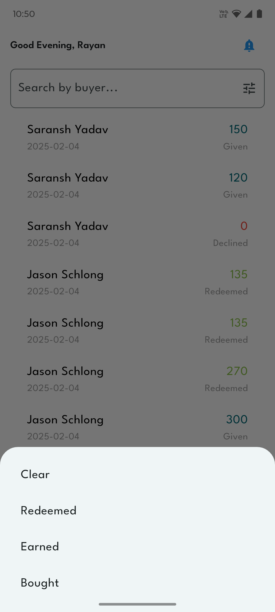

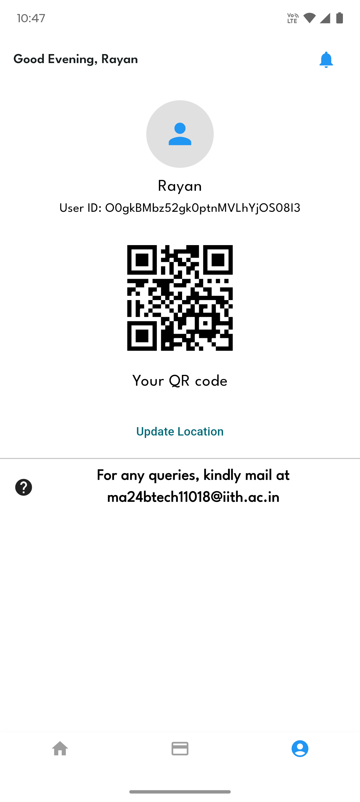

The profile page is structured similarly to that for the consumers. The business's QR code is already implemented, and  customers can use it to make transactions. There is an option to update the store location underneath the QR code. We will soon implement a way to update your location by clicking this option. 

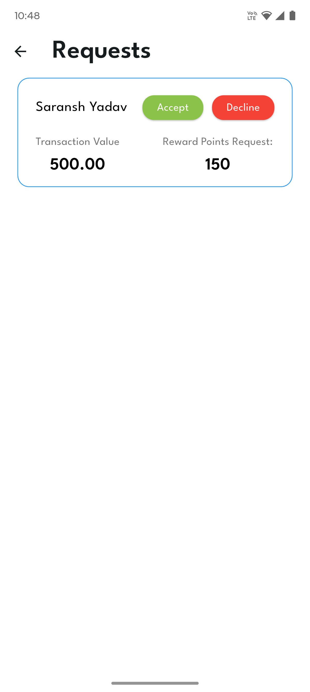

The notifications at the top of the app show all of the requests made by customers at the store. Here, the business owner will accept or decline the customers request for reward points. 


### To test the app locally

- Install the latest flutter tooling from Google's [flutter site](https://flutter.dev/)
- Clone the repo locally on your ocmputer.
- Run ```flutter pub get``` to resolve all dependencies.
- Install `firebase` cli
- Initialie a new firebase instance on your personal account and initialize the flutter project with it.
- Package name for the app is `com.npci_hackathon.huckers`
- Run ```flutterfire configure``` to setup flutter with firebase.
- Run ```flutter run``` to start a debug session on any devices or emulators connected to the workstation.
